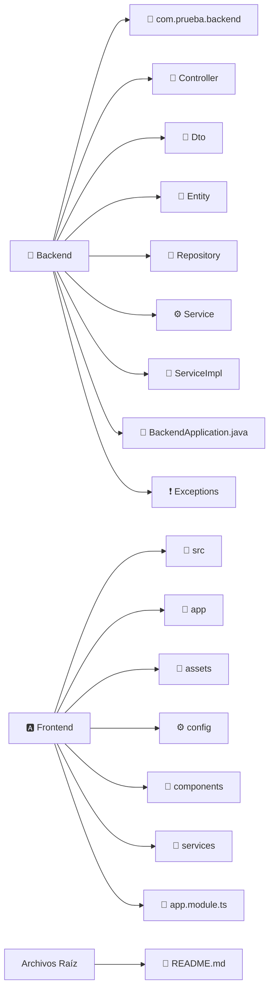

<h1 style="text-align: center">🌱 AgroMinds - Plataforma de Gestión Agrícola Inteligente 🌾</h1>

    
    
    
    

    
    
    
    
    

  
  
  
  

---

## 🚀 Descripción del Proyecto

**AgroMinds** es una aplicación desarrollada con **Spring Boot + JPA + PostgreSQL**, diseñada para la **gestión integral de cultivos, sensores, fertilizantes y notificaciones agrícolas inteligentes**.  
Permite a los agricultores optimizar sus recursos, monitorear sus parcelas, recibir alertas automáticas y mantener un historial digital de sus actividades agrícolas.

El proyecto sigue una arquitectura **por capas (Entities, Repositories, Services, Controllers, DTOs)**, promoviendo la escalabilidad y el mantenimiento del código.

---

## 🧩 Módulos Principales

| Módulo                              | Descripción |
|-------------------------------------|--------------|
| 👨‍🌾 **Usuarios y Clientes**       | Gestión de usuarios, roles y clientes vinculados. |
| 🌿 **Cultivos y Parcelas**          | Registro, seguimiento y estadísticas de cultivos. |
| 🧪 **Fertilizantes y Aplicaciones** | Control de fertilizantes utilizados por cultivo. |
| ⚙️ **Sensores y Lecturas**          | Monitoreo de humedad, temperatura y pH en tiempo real. |
| 📰 **Noticias y Notificaciones**    | Comunicación de eventos, alertas y novedades al usuario. |
| 💬 **Servicios y Solicitudes**      | Solicitud de asesorías, mantenimiento y recursos agrícolas. |

---

## 🏗️ Tecnologías Utilizadas

- ☕ **Java 25**
- 🍃 **Spring Boot 3.5.5**
- 🧭 **Spring Data JPA**
- 🐘 **PostgreSQL**
- 🔁 **JPQL y SQL Nativo**
- 📦 **Arquitectura por Capas**
- 🔒 **Control de roles con Authorities**

---

## 📡 Estructura del Proyecto

## 👨‍💻 Equipo de Desarrollo

**Universidad Peruana de Ciencias Aplicadas - UPC**
Proyecto académico del curso **Análisis y Diseño de Sistemas de Información (ASI-705)**

| Integrante         | Rol           |                                                 GitHub                                                  |
|--------------------|---------------|:-------------------------------------------------------------------------------------------------------:|
| 💻 George Baca     | Fullstack Dev |  |
| 💻 Joshua Piero    | Fullstack Dev |  |
| 💻 Angelo Paolo    | Fullstack Dev |  |
| 💻 Rodrigo Otoniel | Fullstack Dev |   |
| 💻 Frank Antoni    | Fullstack Dev |  |
---

## ⭐ ¡Apoya el Proyecto!

Si te gusta nuestro trabajo, no olvides dejar una **estrella** ⭐ en el repo 💚
y contribuir con ideas o mejoras para futuras versiones.

---

Hecho con 💚 por el equipo de AgroMinds

RECENT Contributions:

### Licence

Copyright © 2025 - AgroMinds